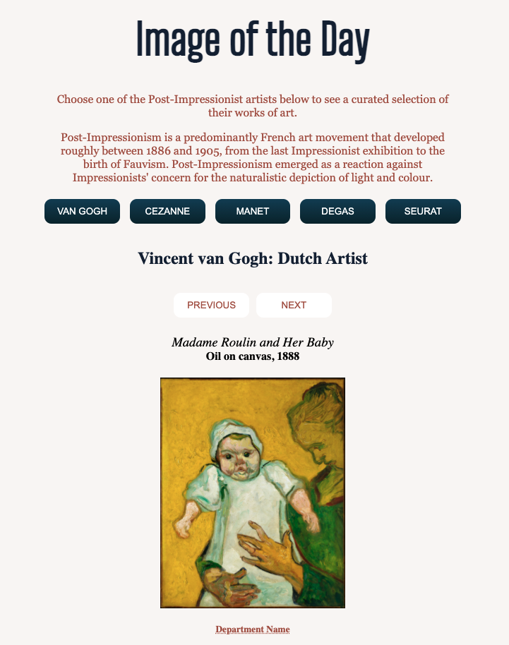

# Image of the Day: Project 1 #

### The live site can be accessed here: [Image of the Day](https://pages.git.generalassemb.ly/mmergal92/Image_API_Project/). 
#### I have included a preview below. 

#### About the Project
For this project, I decided to connect to the [Metropolitan Museum of Art API](https://metmuseum.github.io/). My goal was to link the API and be able to pull the image and information about the works of art from each artist. 

### Technical Details
For this project, I was able to get data from the API through an **Ajax request** using the **GET method**. I used a 'then' function to return the title, medium, date, image, and department of each work of art. 

I then created functions for each artist with **arrays** that had 10 works of art per artist with their Object IDs. The Object ID was the key parameter that allowed me to return all the information for the works of art. Since those had to be searched for using a different API, I hardcoded the array for the 5 artists I wanted to feature. I used **loops** to go through the arrays and display the information in different divs. I then included **buttons** with functions that allowed me to separately display the images in a carousel. Lastly, I included **tooltips** to show the department information for each piece. I included CSS styling for all components and to make the website responsive.

### Some of the challanges I faced during this project:
- The search API and the API where the images and all the information was included were in two different APIs. In order to just have one AJAX call, I hardcoded the Object IDs into separate arrays for each artist.   
- Originally, I had some difficulty being able to go through the array and display the images separately after getting the information from the AJAX call.

### Some stretch goals that I want to work on are: 
- I would like to connect the Search API to the ObjectID API to be able to include a search bar on the site and be able to display images from any artist that is included in the Met collection. 
- Also, I would like to include a "random" button that will pull a random image the entire Met collection to display.
- The user could hover over the image for more information about that work of art.
- It could also include a feature where the user can click on a button for more works of art from this particular artists and go through them in a carousel.
- When the carousel is over, they can choose another artist (the list they could choose from would be artists with similar genres of art or similar cutural backgrounds).

###### &copy; This was created by Maria Mergal. 
